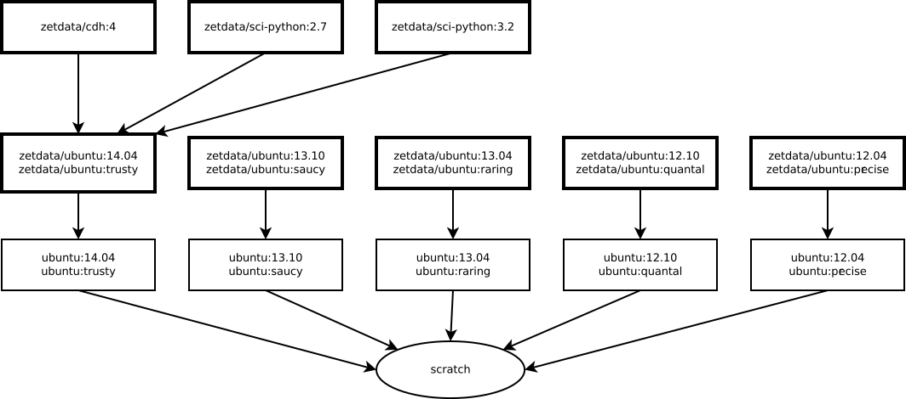

===========
Base Images
===========

Why base images?
================

`Docker <http://docker.io>`__ offers revolutiony platform to build, ship
containerized images. The official images may not match our requirements
for packaging modules. So, our base images are design according to
following reasons:

Base images provide minimum requirements for specific usage. For
example, ``zetdata/cdh:4`` are base images for CDH4 hadoop cluster. And
``zetdata/sci-python:2.7`` can provide
`scikit-learn <http://scikit-learn.org/>`__ toolkit for python data
scientists.

Can also save bandwith. Of course, you can build your own module from
scratch. Docker offers incremental pulling, which will pull differental
images from remote registry server. So, it may save bandwith and time if
we share same base images.

All scripts to build base images are released at `github
repo <https://github.com/DataCanvasIO/docker-brew-datacanvas-base>`__,
and images are pushed to `official docker
registry <http://index.docker.com>`__.

Hierarchy of base images
========================

|image0|

