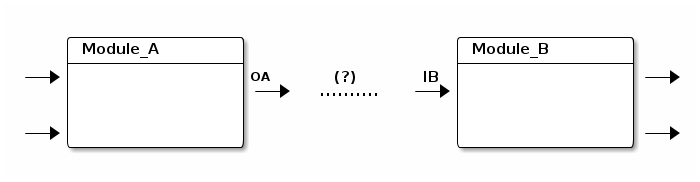

==================
Input/Output Types
==================

Why types?
==========

.. code:: ditaa

        /-----------------\                    /-----------------\
        | Module_A        |                    | Module_B        |
        +-----------------+                    +-----------------+
    --->|                 |OA      (?)      IB |                 |--->
        |                 |---> .......... --->|                 |
        +=================|                    +=================|
        |                 |                    |                 |
    --->|                 |                    |                 |--->
        \-----------------/                    \-----------------/

|image0|

When we connect two pins between modules, the question arise that, can
we connect them? As example in previous diagram shows, if ``Module_A``'s
output **OA** will write
`csv <http://en.wikipedia.org/wiki/Comma-separated_values>`__, and
``Module_B``'s input want read
`tsv <http://en.wikipedia.org/wiki/Tab-separated_values>`__, our task
will failed because of mismatch of types.

So, we borrow a simple type system like `Union
Type <http://en.wikipedia.org/wiki/Union_type>`__. It will help module
designers to constraint module's inputs and outputs. In datacanvas
frontend, we will also do type checking to help user's discover mismatch
between input and output during design stage the work flow.

Informally, a simple-type is a just a string, for example, "csv",
"csv.salary.table", "hive.table.tf". And, simple-type is case sensitive.
Also, Input/Output type is a set of simple-type. So, two Input/Output
pins can connect, if and only if the intersect of two types are not
empty.

Type system will be helpful if it is applied properly. Some wrong way to
use type system are:

#. Use same type for a lot of modules. This will "turn off" type
   checking.
#. Choose type name wisely. Some type name like, "hive.table.A" are less
   informative. It may be less helpful for using that module.

Type List
=========

Hive
----

