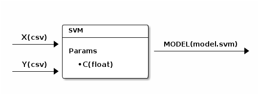

=====================================
Getting Started with Screwjack(Basic)
=====================================

Before you trying following, you should ensure screwjack is installed.
Please refer :doc:`Introduction<intro>` for detail installation steps.

Step 1: Initialize a module
===========================

First, assume you want create a **basic** module, which is a template
with basic functinality. If you interested in writing a 'Hive' module,
please refer to :doc:`Getting Started with Screwjack(Hive)<quickstart-hive>`.

So, you can create a basic module with ``screwjack``:

::

      screwjack init basic --name="SVM" --description="A simple SVM"

Then, it will prompt to setup other options, like the following. In this
tutorial, we will use scikit-learn, which are packed in base image
``zetdata/sci-python:2.7``.

::

      Module Version [0.1]: 
      Module Entry Command [python main.py]: 
      Base Image [zetdata/ubuntu:trusty]: zetdata/sci-python:2.7
      Sucessfully created 'svm'

Or, you can use single command to do this:

.. code:: bash

      screwjack init basic --name=SVM --description="A simple SVM" --version="0.1" --cmd="/usr/bin/python main.py" --base-image="zetdata/sci-python:2.7"

Now, you will get a directory with initial verison of basic module:

::

      svm
      |-- Dockerfile
      |-- main.py
      |-- requirements.txt
      `-- spec.json

      0 directories, 4 files

Then you should change to the directory of the new module, the following
steps will assume we are working at that directory.

.. code:: bash

      cd svm

Step 2: Add Input/Output/Param
==============================

Image we want create a module with two \*Input\*s, one **Output**, and
one parameter. Just like the following diagram shows:

.. code:: ditaa

              /-----------------\
              | SVM             |
      X(csv)  +-----------------+
    --------->|                 |  MODEL(model.svm)
              | Params:         |------------------->
              +=================|
      Y(csv)  | o C(float)      |
    --------->|                 |
              \-----------------/

|image0|

Now we can add a parameter using the following command:

.. code:: bash

      screwjack param_add C float

And, we add two Inputs by the following commands. The first argument
**X** means the name of the input/output, and the second argument
**csv** means the type for this input/output. A type can be any string,
like "csv", "hive.hdfs.table:sub:`x`". For more information about types,
please follow :doc:`Input/Output Types <io-types>`.

.. code:: bash

      screwjack input_add X csv
      screwjack input_add Y csv

Finally, a Output:

.. code:: bash

      screwjack output_add MODEL model.svm

Step 3: Fill your code implementation
=====================================

Now, you can write your awesome implementation now:

.. code:: bash

      vim main.py

In this tutorial, we would like implement our ``main.py`` like this:

.. code:: python

    from datacanvas import DatacanvasRuntime
    from sklearn.svm import LinearSVC
    import numpy as np
    import pickle

    def main():
        rt = DatacanvasRuntime()
        settings = rt.settings

        # TODO: Add your code here
        X = np.genfromtxt(settings.Input.X, delimiter=',', skip_header=1)
        Y = np.genfromtxt(settings.Input.Y, delimiter=',', skip_header=1)
        svc = LinearSVC(C=float(settings.Param.C))
        svc.fit(X,Y)
        with open(settings.Output.MODEL, "w") as f:
            pickle.dump(svc, f)
        print("Done")

    if __name__ == "__main__":
        main()

If you want add additional files for this module, don't forget add files
in ``Dockerfile``.

.. code:: bash

      vim Dockerfile

For example, if you have additional file, you should append the
following line into ``Dockerfile``:

::

      ADD your_additional_file /home/run/

In the case if you want add additional folder, you should append a line
like this:

::

      ADD your_additional_folder /home/run/your_additional_folder

For more information about ``Dockerfile``, please reference
`Dockerfile <http://docs.docker.io/reference/builder/>`__.

Step 4.1: Test in **local**
===========================

After write own implementation into this module, we might want test it.
The ``screwjack run`` subcommands are design for this.

.. code:: bash

      screwjack run local --help

.. code:: bash

      Usage: screwjack run local [OPTIONS]
      Options:
        --param-C TEXT  Param(string)
        --X TEXT        Input
        --Y TEXT        Input
        --MODEL TEXT    Output
        --help          Show this message and exit.

Now, we can test our module in local environment, which is very close to
your developing environment.

.. code:: bash

      screwjack run local --param-C=0.1 --X=a.csv --Y=b.csv --MODEL=tmp.model

Note, in case you can not import "sklearn.svm", you probably should install scikit-learn locally

.. code:: bash

      pip install -U scikit-learn

Step 4.2: Test in **docker**
============================

Then, we can try to execute module by docker:

.. code:: bash

      screwjack run docker --param-C=0.1 --X=a.csv --Y=b.csv --MODEL=tmp.model

Step 5: Submit module
=====================

You should provide the URL of ``spec_server`` to submit:

.. code:: bash

      screwjack submit

